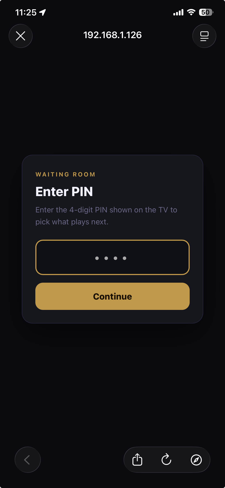
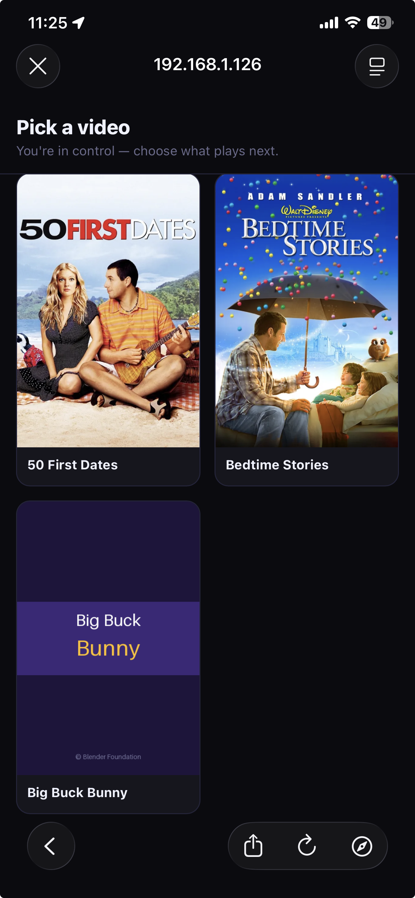
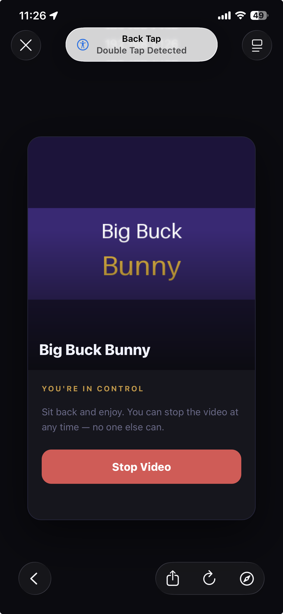
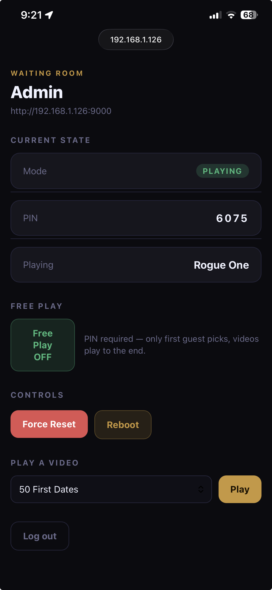

## Screenshots

| TV Display | PIN Entry | Pick a Video |
|---|---|---|
|  |  |  |

| Now Playing | Admin |
|---|---|
|  |  |

# Waiting Room TV Kiosk

A Raspberry Pi kiosk that lets people in a waiting room pick what plays on the TV.
The TV displays a QR code and PIN. Guests scan with their phone, enter the PIN, and
choose a video. Once a video starts it plays to the end — no stopping it.
Others who scan while something is playing see a now-playing screen with the poster art.

## Network requirement

> **Phones must be on the same Wi-Fi network as the Pi.** The app runs locally — there is no internet access or remote connectivity.

## How it works

- **TV display** — Chromium kiosk shows QR code + PIN while idle, title while playing
- **Phone UI** — Guest scans QR → enters PIN → picks a video
- **Choose wisely** — Once a video starts it plays to the end. Only admin can interrupt it.
- **Player** — `mpv` plays the video fullscreen over Chromium
- **PIN rotation** — PIN changes after every video so each round is fresh

## Free Play mode

Toggle **Free Play** on from the admin panel for a no-PIN experience — great for personal use or kids.

| | Normal mode | Free Play mode |
|---|---|---|
| Access | Scan QR + enter PIN | Scan QR — no PIN |
| Who picks | First to enter PIN | Anyone |
| Stop video | Nobody (plays to end) | Anyone |
| Admin override | Always available | Always available |

Free Play can be toggled on/off at any time from `/admin` without rebooting.

## Project layout

```
waiting-room/
├── app/
│   ├── app.py              Flask web app (routes, state, QR generation)
│   └── templates/
│       ├── tv.html         TV kiosk display (polls /api/state every 2s)
│       ├── pin.html        PIN entry page
│       ├── pick.html       Video picker grid (first to enter PIN)
│       ├── control.html    Now playing + Stop button (free play mode only)
│       ├── wait.html       Now playing screen (normal mode, no stop button)
│       └── admin.html      Admin panel (/admin)
├── player/
│   └── player.py           mpv daemon — watches for play requests, handles stop
├── media/                  Videos — one subfolder per title, needs 1 video + 1 poster
├── data/
│   └── state.db            SQLite state (mode, pin, controller_token, etc.)
├── config.env              Secrets — edit before first run
├── requirements.txt        Python dependencies
├── start_display.sh        Launches Chromium kiosk (run by labwc autostart)
├── setup.sh                Full install script for a fresh Pi
└── download_sample.sh      Downloads Big Buck Bunny as a sample/demo video
```

## Requirements

> **Raspberry Pi OS (Full) is required — Lite is missing the desktop environment that this project depends on.**  
> **Tested on Raspberry Pi 5 running Raspberry Pi OS Bookworm (Debian 12).**  
> **Other Pi models and OS versions may work but are untested.**

## Fresh Pi setup

> **Username:** When flashing the Pi, set the username to `pitv`. If you use a different username, edit the `APP_USER` variable at the top of `setup.sh` before running it.

```bash
# 1. Update the system first (do this once after a fresh flash)
sudo apt update && sudo apt full-upgrade -y
sudo reboot
```

After it reboots:

```bash
# 2. Clone, configure, and install
git clone https://github.com/alwaysunpredictable/pitv.git waiting-room
cd waiting-room
```

Edit `config.env` before running setup — see [Config](#config) below for details.

```bash
sudo bash setup.sh
sudo reboot
```

`setup.sh` handles everything:
- Installs packages (`mpv`, `chromium-browser`, `python3-venv`, etc.)
- Creates/configures the `pitv` user with correct groups (including `autologin`)
- Creates the Python virtualenv and installs dependencies
- Generates a random `APP_SECRET` in `config.env`
- Installs and enables systemd services (`pitv-app`, `pitv-player`)
- Configures LightDM autologin for the `pitv` user
- Creates `~/.config/labwc/autostart` so Chromium launches at desktop start

## Config

Edit `/home/pitv/waiting-room/config.env`:

```
APP_SECRET=<auto-generated by setup.sh — do not change after first run>
ADMIN_PASS=changeme
```

`APP_SECRET` signs session cookies. Changing it logs everyone out.

## Adding videos

Each video needs its own subfolder under `media/`, containing one video file and one poster image:

```
media/
├── Big Buck Bunny/
│   ├── Big Buck Bunny.mp4
│   └── Big Buck Bunny.png
└── My Other Video/
    ├── My Other Video.mp4
    └── My Other Video.jpg
```

The poster image is optional — videos without one will appear in the picker with a placeholder card. Portrait ratio (2:3) works best for the poster.

Supported video formats: `.mp4`, `.mkv`, `.mov`, `.avi`
Supported poster formats: `.webp`, `.png`, `.jpg`, `.jpeg`

To get started quickly, run the included sample downloader — it fetches Big Buck Bunny (~62MB) and generates a poster for it:

```bash
bash download_sample.sh
```

## Admin panel

Visit `http://<pi-ip>:9000/admin` — lets you force-reset, play any video, or reboot.

## Services

```bash
sudo systemctl status pitv-app      # web app (Gunicorn on port 9000)
sudo systemctl status pitv-player   # mpv player daemon
sudo journalctl -u pitv-app -f      # live app logs
sudo journalctl -u pitv-player -f   # live player logs
```

## Manual display restart (without rebooting)

If Chromium closes, labwc will not auto-relaunch it. Either reboot or run:

```bash
WAYLAND_DISPLAY=wayland-0 XDG_RUNTIME_DIR=/run/user/1000 \
  /home/pitv/waiting-room/start_display.sh &
```

## Raspberry Pi OS notes

These things are handled by `setup.sh` but good to know for troubleshooting:

| Thing | Why it matters |
|---|---|
| `pitv` in `autologin` group | LightDM skips password on boot |
| `~/.config/labwc/autostart` | labwc (Wayland) runs this at session start — `.desktop` files in `~/.config/autostart/` are NOT processed by labwc |
| `--password-store=basic` in Chromium flags | Stops Chromium asking to unlock the GNOME keyring on every start |
| `--ozone-platform=wayland` in Chromium flags | Makes Chromium run natively on Wayland instead of via XWayland |
| `--gpu-context=wayland` in mpv flags | Makes mpv open a Wayland window that overlays on top of Chromium |
| WAYLAND_DISPLAY injected into mpv env | `pitv-player` is a systemd service with no display env — player.py reads it from the labwc process |
